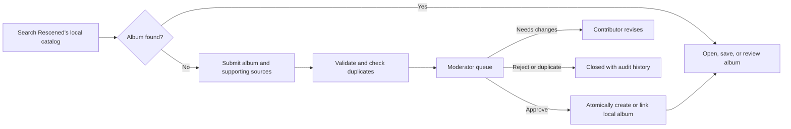

# Rescened Community Catalog Roadmap

Status: Phase 1 implementation complete; ready for Phase 2 submission workflow

Near-term goal: establish a small provider-neutral catalog foundation, ship community album submissions and moderation, and deploy

Long-term goal: grow Rescened's locally owned catalog with MusicBrainz data and community corrections without depending on Spotify

## Decision summary

The existing Mongo data is pre-launch and disposable. It will be exported and verified for safety, but it will not be migrated into the new schema.

This changes the implementation order:

1. Replace Spotify IDs with Rescened-owned album IDs before building submissions.
2. Remove Spotify API behavior instead of maintaining a compatibility migration.
3. Build submissions and moderation directly on the final local identity.
4. Make approval create or link a local album immediately.
5. Deploy the community workflow with a small catalog.
6. Build and run the larger MusicBrainz seed pipeline in the background.

An approved suggestion will be searchable, routable, saveable, and reviewable as soon as approval succeeds. There is no longer an approved-but-waiting-for-a-later-catalog state.



## Product rules

- `AlbumCatalog` is the product database, not a provider cache.
- A Rescened-owned `albumId` is the canonical identity everywhere.
- Spotify and MusicBrainz identifiers are optional external references, never primary keys.
- Pending submission data never appears in public search, feeds, statistics, or album routes.
- A successful approval always points to a valid local album.
- Community-verified fields outrank later automated imports.
- MusicBrainz helps bootstrap and discover data; the application continues to work during a MusicBrainz outage.
- Cover artwork is governed separately from MusicBrainz core metadata.
- No old Mongo documents need dual reads, backfills, redirects, or compatibility writes.

## Deliberately deferred work

To keep the first deployment focused, the initial rewrite will not include:

- A complete MusicBrainz mirror.
- Millions of imported albums.
- A fully normalized artist, label, recording, and edition graph.
- Wiki-style correction editing for every album field.
- Contributor reputation or trusted-editor automation.
- Cover-art uploads or bulk Cover Art Archive ingestion.
- Migration of the disposable Spotify-keyed data.

The initial catalog represents an album concept with enough representative release metadata for the current UI. A separate edition/release model can be introduced later without changing the canonical album identity.

## Roadmap overview

| Track | Phase | Outcome | Required before first deployment? |
| --- | --- | --- | --- |
| Reset | 0. Archive and reset boundary | Verified export and safe clean-slate cutover | Yes |
| Foundation | 1. Provider-neutral catalog | Every feature works with local album IDs and no Spotify API | Yes |
| Community | 2. Submission and moderation backend | Safe, auditable approval workflow | Yes |
| Community | 3. User and moderator UI | Complete contribution and review experience | Yes |
| Launch | 4. Hardening and deployment | Community catalog is live with rollback controls | Yes |
| Background | 5. Search and MusicBrainz seed | A useful, substantially larger local catalog | No |
| Background | 6. MusicBrainz-assisted discovery | Missing records can prefill the same submission flow | No |
| Ongoing | 7. Community database maturity | Corrections, editions, merges, and trusted editors | No |

The first public release ends at Phase 4. Phases 5–7 can proceed while the deployed community queue is operating.

---

## Phase 0 — Archive and reset boundary

### Objective

Create a recoverable boundary between the discarded Spotify-shaped database and the new local catalog.

### Before resetting Mongo

- Stop or disable writes from the current backend. Its search fallback can repopulate `AlbumCatalog` from Spotify.
- Export every Mongo collection, not only `AlbumCatalog`.
- Record the database name, export date, application commit, collection names, and document counts.
- Restore the export into a temporary database once and compare the collection counts.
- Keep the verified archive until the new system has been stable for an agreed retention period.
- Remember that Clerk users and production secrets are not contained in the Mongo export.
- Prefer connecting the rewritten application to a new database name rather than reusing a partially emptied database.

The archive is for emergency recovery and historical reference. It is not an input to a later backfill unless that decision is explicitly reopened.

### Repository safety work

- Remove or production-gate the unprotected development seed endpoint in [`routes/auth.js`](routes/auth.js).
- Document the old database as schema generation 1 and the clean local catalog as schema generation 2.
- Add an explicit reset/initialization runbook; do not make destructive database deletion part of normal application startup.
- Ensure no production process is still pointed at the database before it is reset.

### Exit gate

- The archive has successfully restored in a temporary database.
- Collection counts are recorded.
- The old backend cannot write to the reset target.
- The schema-generation boundary and rollback location are documented.

---

## Phase 1 — Provider-neutral catalog foundation

### Objective

Make the entire application work with a Rescened-owned album identity before introducing community submissions.

This is a bounded identity rewrite, not the full MusicBrainz overhaul.

### Canonical identity

Use an immutable Rescened-generated UUID v4 as the public canonical identity and expose it consistently as `albumId` in API responses and URLs. Mongo `_id` remains an internal relation key and is never used as the public album identity.

Every album-related document should reference the catalog record using `albumCatalogId`:

- Saved albums.
- Board items.
- Reviews.
- Album likes.
- Profile favorites and listening-next selections.
- Notifications and activity payloads.

No new schema or API should require `spotifyId`.

### Minimal `AlbumCatalog` shape

The first local catalog needs only the fields required to search, render, save, and review an album:

```text
albumId                     immutable Rescened-generated UUID v4
_id                         internal Mongo relation key
title
artistDisplayName
artistCredits[]
releaseType                 album, ep, mixtape, soundtrack, etc.
releaseDate
releaseDatePrecision        year, month, or day
releaseYear
tracks[]                    optional for manually approved records
label                       optional
cover                       optional, with source/provenance
externalReferences[]        optional provider, entity type, external ID, URL
fieldProvenance             source and community-verification information
catalogSource               community, musicbrainz_import, or moderator
createdAt / updatedAt
```

Initial `AlbumCatalog` records represent the album concept. Store a representative tracklist when available, but defer a separate edition model until the product needs country/format/label-specific releases.

### External-reference rules

- Make `(provider, entityType, externalId)` unique when an external ID exists.
- Support MusicBrainz release-group and release IDs as optional references.
- Provider references may be retained only as optional outbound references; they must never trigger API access.
- Never make a MusicBrainz ID the Mongo primary key.
- Record where imported and moderator-approved fields came from.

### Application rewrite

- Change `/album/:id` and all frontend links so `id` means local `albumId`.
- Change save, collection, board, review, like, profile, feed, notification, and statistics queries to use `albumCatalogId`.
- Return a consistent local `albumId` from every album serializer.
- Make search query only the local catalog.
- Ensure an empty catalog produces useful empty states rather than provider errors.
- Replace Spotify-specific response properties with provider-neutral fields.
- Keep optional outbound provider links behind a generic `externalLinks` interface.

### Spotify removal

- Remove Spotify token acquisition and API calls.
- Remove Spotify search fallback and album-detail enrichment.
- Remove Spotify-specific rate limiting and server credential validation.
- Remove Spotify-dependent tests and replace them with local-catalog tests.
- Remove or redesign MusicBrainz enrichment that begins with a Spotify URL mapping.
- Disable Spotify-dependent artist/ListenBrainz discovery until it can start from direct MusicBrainz artist references.
- Remove Spotify-specific UI labels and icons except any intentionally retained outbound link.
- A user's optional Spotify profile link is a separate product choice and does not require the Spotify API.

### Search for the small launch catalog

Mongo text search is acceptable for the small community-created catalog used at launch. Keep it behind a provider-neutral search service so the implementation can be replaced before bulk importing tens of thousands of records.

### Exit gate

- The app starts without Spotify credentials.
- A locally created album with no external references can be searched, opened, saved, reviewed, liked, added to a board, and placed on a profile.
- All album API payloads and frontend routes use local `albumId`.
- Static repository search finds no unintended Spotify API, `spotifyId`, or provider-specific route dependencies.
- Backend tests, frontend build, and frontend lint pass against an empty schema-generation-2 database.
- No legacy-data compatibility code was added.

---

## Phase 2 — Submission and moderation backend

### Objective

Create a secure, auditable workflow in which moderator approval immediately creates or links a usable local album.

### Submission states

Use a single user-visible workflow:

- `pending`
- `needs_changes`
- `approved`
- `rejected`
- `duplicate`
- `withdrawn`

An `approved` submission must have an `approvedAlbumCatalogId`. The approval operation does not report success until that album exists and can be read through the normal album service.

If catalog publication fails, the operation fails without marking the submission approved. It remains safely retryable; there is no publicly approved but unusable state.

### Suggested model

Add `models/AlbumSubmission.js` with fields conceptually equivalent to:

```text
submittedByUserId
proposedMetadata
supportingSources[]
externalReferences[]
candidateAlbumCatalogId       optional existing match
normalizedFingerprint
status
approvedAlbumCatalogId        required when approved
duplicateOfSubmissionId       required when marked duplicate
currentRevision
revisions[]                   immutable submitted snapshots
moderationHistory[]           actor, action, reason, timestamp
createdAt / updatedAt
```

Rejected, duplicate, and withdrawn records remain available for audit and duplicate detection. Normal application endpoints must not hard-delete moderation history.

### Initial submission contract

Required:

- Album title.
- At least one artist credit.
- Release type.
- Release year or date with precision.
- At least one supporting source.

Optional:

- MusicBrainz release-group or release reference.
- Official artist, label, distributor, or store URL.
- Spotify URL as supporting evidence only.
- Label, country, catalog number, barcode, and tracklist.
- Moderator notes.
- Cover source URL, recorded as evidence rather than fetched automatically.

MusicBrainz should be the preferred structured source but not a requirement. Albums missing from MusicBrainz must still be submittable.

### User API

- `POST /suggestions` — create an authenticated submission.
- `GET /suggestions/mine` — cursor-paginated status history for the current user.
- `GET /suggestions/:submissionId` — owner or moderator detail.
- `POST /suggestions/:submissionId/revise` — add a revision after `needs_changes`.
- `POST /suggestions/:submissionId/withdraw` — withdraw an active owned submission.
- `GET /suggestions/approved` — optional public feed of approved additions.

### Moderator API

- `GET /moderation/album-suggestions` — filterable, cursor-paginated queue.
- `GET /moderation/album-suggestions/:submissionId` — proposal, evidence, matches, and history.
- `POST /moderation/album-suggestions/:submissionId/request-changes`.
- `POST /moderation/album-suggestions/:submissionId/approve`.
- `POST /moderation/album-suggestions/:submissionId/reject`.
- `POST /moderation/album-suggestions/:submissionId/mark-duplicate`.

Use command endpoints for transitions. Never accept an arbitrary status replacement or a client-supplied reviewer identity.

### Authorization and abuse controls

- Require Clerk authentication for all submission mutations.
- Use a server-only `MODERATOR_USER_IDS` allowlist for the first launch, then move to a Clerk role/custom claim later.
- Return `401` for anonymous requests and `403` for authenticated non-moderators.
- Add `COMMUNITY_SUBMISSIONS_ENABLED` and `COMMUNITY_MODERATION_ENABLED` server-side feature flags.
- Add dedicated rate limits for submission creation/revision and moderator mutations.
- Whitelist every accepted request property; never spread `req.body` into a database update.
- Set strict string, array, track, and source-count limits.
- Accept only `https:` source URLs initially.
- Do not fetch user-supplied URLs from the backend during the MVP, avoiding an SSRF path.
- Retain rejected submissions for abuse review while keeping them private.

### Duplicate handling

Check both `AlbumCatalog` and active submissions using:

- Exact MusicBrainz IDs.
- Exact barcode or catalog number where available.
- Other exact external references.
- A normalized title, artist, release-type, and year fingerprint as a review signal.

External IDs can support hard uniqueness. Normalized text fingerprints should usually flag possible duplicates rather than automatically merge records because legitimate releases can share similar metadata.

### Approval transaction

Implement one idempotent service, such as `approveAlbumSubmission`, which:

1. Re-checks moderator authorization and current submission state.
2. Re-runs catalog and submission duplicate checks.
3. Links to an existing local album or constructs a valid new `AlbumCatalog` record.
4. Records community/moderator provenance.
5. Sets `approvedAlbumCatalogId` and appends the moderation event.
6. Returns the normal local album URL.

Use a Mongo transaction where the deployment supports it. Otherwise, use unique constraints and an idempotent recovery design that cannot expose a half-approved submission.

### Exit gate

- Pending data cannot appear in public search, routes, feeds, counts, or social activity.
- Approval immediately produces a searchable and fully usable album.
- Approval and duplicate handling remain correct under concurrent requests.
- Users can view, revise, or withdraw only their own eligible submissions.
- Moderator routes enforce server-side authorization.
- Invalid, oversized, and rate-limited requests have predictable responses.
- Model indexes, transitions, authorization, privacy, and approval behavior have automated tests.

---

## Phase 3 — User and moderator UI

### Objective

Expose the contribution flow without making users understand the database architecture or MusicBrainz identifiers.

### Contributor flow

1. Search the local catalog.
2. If the album is absent, select **Suggest an album**.
3. Enter minimum metadata and supporting sources.
4. Review a preview of the proposed album.
5. Submit and receive a stable status page.
6. Revise if a moderator requests changes.
7. After approval, follow the link directly to the usable album page.

### Contributor UI

- Add authenticated `/suggestions/new`.
- Add `/account/suggestions` with pending, needs-changes, approved, rejected, duplicate, and withdrawn states.
- Put the suggestion call to action in search empty states.
- Prefill title/artist from the search query when useful, while requiring confirmation.
- Explain why evidence is requested and why suggestions are moderated.
- Make MusicBrainz fields optional and explain them in plain language.
- Use a placeholder cover when artwork is absent or unverified.
- Add accessible validation, loading, empty, error, and rate-limit states.

### Moderator UI

- Add protected `/moderation/album-suggestions`.
- Filter by status, age, submitter, source availability, and duplicate likelihood.
- Show the proposed record beside catalog matches.
- Show every submitted revision and moderation action.
- Require a reason for rejection, duplicate marking, and change requests.
- Display a successful approval with a direct link to the newly usable album.

The UI may hide moderator navigation from normal users, but the API remains the security boundary.

### Exit gate

- A user can complete a submission without knowing what an MBID is.
- A moderator can process the complete queue from the application.
- Approval navigates to a searchable, reviewable local album.
- Refreshing does not lose submission status or revision history.
- Mobile and desktop flows pass manual smoke tests.
- Frontend build and lint checks pass.

---

## Phase 4 — Hardening and deployment

### Objective

Deploy the local community catalog before the large MusicBrainz import is ready.

### Pre-deployment work

- Run the full route, model, authorization, state-transition, duplicate-race, rate-limit, and approval test suites.
- Build required Mongo indexes before enabling writes.
- Test the full application against an empty staging database.
- Create several staging albums entirely through moderation; test search, details, reviews, saves, boards, likes, profiles, and notifications.
- Confirm where the Express API will run; [`vercel.json`](vercel.json) currently builds only the React frontend.
- Configure a persistent API URL and point `VITE_API_URL` to it.
- Verify production CORS, Clerk, Mongo, feature-flag, moderator, and MusicBrainz identification settings.
- Confirm that no Spotify credentials are required or configured.
- Decide whether the API will run more than one instance. The current in-memory rate limiters are per process and require shared storage before horizontal scaling.
- Ensure `/health` confirms a connected database before the deployment is considered ready.
- Avoid logging raw submission notes or full source URLs in error telemetry.

### Coordinated cutover

Because the old frontend and API use Spotify IDs while the new versions use local IDs, deploy them as one schema-generation-2 release:

1. Put the old pre-launch site into maintenance mode or stop its writes.
2. Verify the archived generation-1 export one final time.
3. Initialize a clean generation-2 database and its indexes.
4. Deploy the new API against generation 2 with submission and moderation writes disabled.
5. Deploy the new frontend.
6. Run production smoke tests with a locally created album.
7. Enable moderation for the initial moderator account.
8. Process several controlled submissions end to end.
9. Enable submissions for a small cohort or observation window.
10. Monitor and then enable submissions generally.

### Rollback

- Disable submissions immediately with `COMMUNITY_SUBMISSIONS_ENABLED=false`.
- Disable moderator mutations independently with `COMMUNITY_MODERATION_ENABLED=false`.
- Preserve generation-2 catalog and audit records during an application rollback.
- If the entire cutover fails, restore or reconnect generation 1 together with the old application; never run old code against the new schema or new code against the old schema.
- Keep the verified generation-1 archive until generation 2 passes its retention period.

### Initial monitoring

- Submission volume, error rate, and rate-limit events.
- Oldest pending item and median queue age.
- Approval, rejection, duplicate, change-request, and withdrawal rates.
- Approval transaction failures and retries.
- `401`, `403`, `429`, and `5xx` rates on new endpoints.
- Search latency and empty-result rate.
- Moderator action latency.
- Unexpected outbound provider calls; Spotify calls should remain zero.

### Production exit gate

- A normal user and a moderator complete the production flow.
- Approved albums work across every social feature.
- Pending or rejected metadata never appears publicly.
- Feature-flag rollback has been tested.
- No Spotify credential or network call is required.
- The moderation queue has a named owner and response target.

At this point community submissions are deployed. The MusicBrainz seed is a background expansion project rather than a launch blocker.

---

## Phase 5 — Local search and MusicBrainz seed pipeline

### Objective

Grow the owned catalog substantially without replacing local IDs or overwriting community decisions.

### Search before bulk import

The launch catalog can use Mongo text search. Before importing tens of thousands of records:

- Keep search behind the provider-neutral service introduced in Phase 1.
- Select and benchmark a production search index, such as MongoDB Atlas Search or a dedicated engine.
- Use stable relevance ordering and cursor-based pagination.
- Index title variants, artist credits, year, release type, and external aliases.
- Measure query latency, index-build time, database size, and backup time with a pilot dataset.
- Keep the live community catalog usable while a new index or import batch is being prepared.

### Official data source

Use MusicBrainz's official core data dumps rather than HTML scraping or API fan-out. Core MusicBrainz data is published under CC0. The compressed JSON Lines dumps are a practical source for a Mongo-oriented projection.

Do not import supplementary ratings, tags, annotations, edit history, derived statistics, or search indexes without making a separate licensing decision.

Official references:

- [MusicBrainz data license](https://musicbrainz.org/doc/About/Data_License)
- [MusicBrainz database downloads and licensing](https://musicbrainz.org/doc/MusicBrainz_Database/Download)
- [MetaBrainz JSON and PostgreSQL dump guidance](https://metabrainz.org/datasets/postgres-dumps)
- [Canonical MusicBrainz data](https://musicbrainz.org/doc/Canonical_MusicBrainz_data)
- [MusicBrainz release-group semantics](https://musicbrainz.org/doc/Release_Group)

### Seed stages

1. Build a streaming, resumable importer with `--dry-run` and bounded batch writes.
2. Run a roughly 10,000-release-group pilot in staging.
3. Measure search quality, storage, index time, backup time, and import reconciliation.
4. Import roughly 50,000 production candidates if the pilot passes.
5. Expand toward 100,000–250,000 only after measured infrastructure and search behavior remain acceptable.

These sizes are validation gates, not permanent catalog limits.

### Initial filter

- Primary type album or EP.
- At least one official release.
- Required title, artist credit, release date/year, and usable representative release.
- Exclude cancelled, withdrawn, pseudo-release, bootleg, broadcast, audiobook, and spoken-word records initially.
- Make an explicit product decision for live albums, compilations, remixes, mixtapes, and soundtracks.
- Select one representative official release for the initial tracklist and display metadata.

The canonical-release mapping identifies a representative release, but it does not contain a complete ordered tracklist by itself. Join the chosen ID to the release dump to obtain media, positions, recording IDs, and durations.

### Import guarantees

- Stream compressed data instead of loading a dump into memory.
- Record dump version/date, importer version, filter version, source IDs, and license category.
- Use idempotent upserts and resumable checkpoints.
- Stage and validate batches before exposing them to public search.
- Preserve existing Rescened album IDs on every rerun.
- Treat exact MusicBrainz references as hard duplicate keys.
- Treat normalized text matches as merge candidates requiring deterministic rules or review.
- Never overwrite community-verified or moderator-overridden fields.
- Allow imports to fill missing fields while recording field-level provenance.
- Re-check the catalog immediately before insert so an album approved during the import is not duplicated.
- Produce accepted, skipped, updated, duplicate, ambiguous, and invalid counts.
- Make an import batch pausable or reversible without deleting community-created albums.

A full local MusicBrainz PostgreSQL mirror and replication feed can remain a separate future service. Mongo only needs the curated projection Rescened uses.

### Artwork boundary

Cover Art Archive images are separate from MusicBrainz core metadata and should not be assumed to be CC0. Start with placeholders or explicitly sourced artwork. Add provenance, caching rules, a rights policy, and a takedown process before bulk artwork ingestion.

See the [Cover Art Archive documentation](https://musicbrainz.org/doc/Cover_Art_Archive) and [MusicBrainz copyright/DMCA guidance](https://musicbrainz.org/doc/Copyright_and_DMCA_Compliance).

### Exit gate

- The importer can rebuild its projection in staging from an empty database.
- A stopped job resumes without duplicate records or lost checkpoints.
- Search meets an agreed latency target at the planned catalog size.
- Community changes win every import conflict.
- Imported records carry dump and field provenance.
- The application continues to operate when MusicBrainz is unavailable.

---

## Phase 6 — MusicBrainz-assisted discovery

### Objective

Make missing-album submissions faster without making the live MusicBrainz API the product database.

### Flow

1. Search Rescened locally.
2. If absent, offer an explicit **Search MusicBrainz** action.
3. Show MusicBrainz matches as proposal candidates, not public Rescened albums.
4. Let the user select a match and confirm the prefilled submission.
5. If nothing matches, continue with the manual form.
6. Apply the normal moderation and approval workflow.

Do not silently add every MusicBrainz search result to `AlbumCatalog`. A user confirmation plus moderation decision remains the admission path for missing records outside the managed bulk seed.

### Integration rules

- Use direct MusicBrainz identifiers, not Spotify-to-MusicBrainz mapping.
- Send a meaningful identified `User-Agent`.
- Respect MusicBrainz rate limits and terms.
- Cache lookup responses and deduplicate simultaneous queries.
- Use the API for explicit lookup and repair, not bulk import.
- Keep manual submission available during provider downtime.

Official references:

- [MusicBrainz API](https://musicbrainz.org/doc/MusicBrainz_API)
- [MusicBrainz API rate limiting](https://musicbrainz.org/doc/MusicBrainz_API/Rate_Limiting)

### Exit gate

- MusicBrainz results never become public without the normal approval path.
- Provider failures degrade to manual submission.
- Lookup traffic stays within the documented access rules.
- Approved results receive Rescened IDs and work without future provider calls.

---

## Phase 7 — Community database maturity

After the first deployment and seed pipeline are stable, expand from album additions into a moderated knowledge base:

- Metadata correction proposals for existing albums.
- Field-level diffs and public revision history.
- Duplicate merge proposals with social-data reassignment rules.
- Separate release/edition records for country, date, label, format, barcode, artwork, and tracklist variants.
- Normalized artist, label, recording, and relationship entities where product features require them.
- Trusted-editor roles with narrow fast-track permissions.
- Moderator assignment, escalation, appeals, and conflict-of-interest rules.
- Contributor attribution and reputation based on accepted work rather than raw volume.
- Takedown and rights workflows for artwork and user-contributed media.

The submission, revision, moderation-history, provenance, and local-identity foundations from earlier phases should support this evolution without another identity migration.

## Parallel execution after launch

Once Phase 4 is deployed, the operational and data-expansion work can proceed independently:

| Live community track | Background catalog track |
| --- | --- |
| Operate and monitor the moderation queue | Benchmark search with the 10k pilot |
| Improve validation and duplicate review | Build resumable dump imports |
| Add correction submissions | Refine MusicBrainz filters and reconciliation |
| Improve moderator tooling | Add explicit MusicBrainz lookup |
| Establish contributor policies | Design editions and normalized entities only when needed |

The live track owns production stability. Import batches remain staged and independently disable-able until their acceptance gates pass.

## Risk register

| Risk | Mitigation |
| --- | --- |
| Reset occurs before the export is usable | Restore-test the complete export and retain counts before deletion |
| Old deployment repopulates the reset database | Stop old writes and use a new generation-2 database name |
| The suggestion MVP accidentally retains Spotify identity | Complete and test Phase 1 before adding submission models or UI |
| Client hides moderation UI but API remains open | Enforce and test moderator authorization on every server route |
| Spam or abusive submissions | Authentication, rate limits, field limits, duplicate checks, retained audit data, and kill switches |
| User-supplied URL attacks | Accept bounded `https:` strings and do not server-fetch them in the MVP |
| Concurrent approvals create duplicates | Transactional/idempotent approval plus unique external-reference constraints |
| Import and moderation create the same album | Re-check before insert, use hard provider keys, and reconcile ambiguous fingerprints |
| Import overwrites community work | Field provenance and explicit community/moderator precedence |
| Bulk seed overwhelms search or Mongo | Stage a 10k pilot, benchmark, then increase in measured batches |
| Artwork has unclear rights | Keep artwork outside the CC0 assumption and require provenance/takedown handling |
| Per-process rate limits fail when scaling | Move rate limits to shared storage before running multiple API instances |
| Frontend deploys without a production API | Document and smoke-test the API host separately from the Vercel frontend |
| Empty launch catalog feels broken | Design strong empty states and approve a small controlled starter set before opening access |

## Immediate implementation milestone

Implementation should begin with Phase 1, after the Phase 0 export is verified:

1. Finalize the minimal `AlbumCatalog` and `externalReferences` contracts.
2. Replace album identity with local `albumId`/`albumCatalogId` across every model.
3. Rewrite routes, serializers, frontend links, and social queries around the local ID.
4. Remove Spotify calls, credentials, fallbacks, provider-specific enrichment, and tests.
5. Verify that a provider-less album works across the whole application.
6. Then implement the submission model, authorization, state machine, validation, and approval transaction.
7. Build the contributor and moderator UI only after the backend contract is tested.

This sequencing adds a short foundation phase before the community feature, but it eliminates a second migration and makes every approved suggestion immediately usable from the first deployment.
