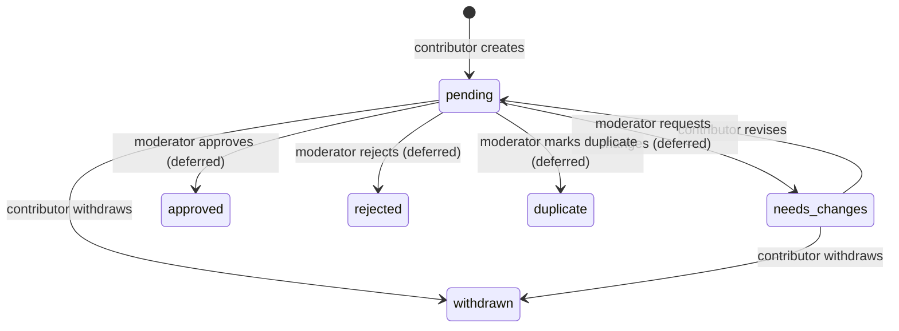

# Phase 2 Community Album Submissions

Status: contributor backend implemented; moderator decisions and catalog publication are deferred

This document describes the Phase 2a album-submission backend as it exists today. It is the source of truth for the contributor API, stored submission data, validation rules, privacy boundary, duplicate signals, configuration, and the work that remains before Phase 2 is complete.

## Current scope

Phase 2a lets an authenticated Clerk user:

- Submit a proposed album with evidence.
- List their submission history.
- Read one of their submissions.
- Revise a submission after a moderator requests changes.
- Withdraw an active submission.

An allowlisted moderator can read a contributor submission through the same detail endpoint. Moderator queue and command endpoints do not exist yet.

Submissions are private workflow records. Creating or revising one never creates an `AlbumCatalog` record and therefore cannot make pending metadata appear in public search, album routes, feeds, statistics, reviews, saves, likes, profiles, boards, or notifications.

The implementation is centered on:

- `models/AlbumSubmission.js` for the aggregate, embedded revisions, and audit events.
- `routes/suggestions.js` for the contributor API.
- `routes/utils/submissions.js` for normalization, validation, fingerprints, duplicate candidates, pagination cursors, serialization, and configuration parsing.
- `routes/utils/rateLimit.js` for contributor mutation limits.

### Phase 2 status

| Capability | Status |
| --- | --- |
| Submission aggregate, validation, revisions, and audit events | Implemented |
| Contributor create, history, detail, revise, and withdraw API | Implemented |
| Submission feature flag and contributor mutation limits | Implemented |
| Advisory catalog and active-submission duplicate signals | Implemented |
| Moderator queue, detail, authorization boundary, and commands | Deferred |
| Idempotent approval and immediate `AlbumCatalog` publication | Deferred |
| Optional public approved-submission feed | Deferred |
| Contributor and moderator UI | Phase 3 |

## Configuration

The existing API requirements still apply:

- `MONGO_URI`
- `CLERK_SECRET_KEY`
- `CLERK_PUBLISHABLE_KEY` or `VITE_CLERK_PUBLISHABLE_KEY`

Phase 2a adds two optional variables:

| Variable | Behavior |
| --- | --- |
| `COMMUNITY_SUBMISSIONS_ENABLED` | Submission mutations are enabled only when this value is `true`, ignoring case and surrounding whitespace. It is disabled when missing or set to any other value. Read endpoints remain available. |
| `MODERATOR_USER_IDS` | Comma-separated Clerk user IDs allowed to read any submission detail. This does not grant moderator mutation powers because those routes are not implemented yet. |

Example local values:

```dotenv
COMMUNITY_SUBMISSIONS_ENABLED=true
MODERATOR_USER_IDS=user_abc123,user_def456
```

The rate limiters use process memory, matching the rest of the current API. Each API instance therefore maintains its own counters. Shared storage is required before horizontally scaling the API. Except for `/health`, requests also pass through the global limit of 300 requests per IP per five minutes before reaching the submission router. `TRUST_PROXY_HOPS` controls Express proxy handling and therefore affects IP-based keys. Unexpected limiter failures log and fail open rather than taking down the API.

## Public identity and privacy

Every submission receives an immutable UUID v4 exposed as `submissionId`. MongoDB `_id` values remain internal.

Public contributor responses never expose:

- The submission document `_id`.
- Internal `AlbumCatalog` ObjectIds.
- Internal candidate-submission ObjectIds.
- Raw duplicate-signal keys or another contributor's proposal.

Responses reduce internal matching data to `hasPossibleDuplicate` and, when an album reference is populated, a public `candidateAlbumId` or `approvedAlbumId`.

All endpoints require Clerk authentication. A detail request made by an authenticated user who is neither the owner nor allowlisted returns `404`, not `403`, so the API does not reveal whether another user's private submission exists.

## Submission aggregate

`AlbumSubmission` stores the current proposal and its complete history in one document.

| Field | Purpose |
| --- | --- |
| `submissionId` | Immutable public UUID v4. |
| `submittedByUserId` | Clerk user ID taken from server authentication, never from the request body. |
| `proposedMetadata` | Current normalized album proposal. |
| `supportingSources` | One to ten HTTPS evidence links. |
| `externalReferences` | Up to twenty structured non-Spotify provider references. |
| `normalizedFingerprint` | SHA-256 review signal derived from title, artists, release type, and year. |
| `candidateAlbumCatalogId` | Optional internal reference to a possible existing catalog match. |
| `candidateSubmissionIds` | Up to ten internal references to possible active-submission matches. |
| `duplicateSignals` | Internal match type, target type, match key, and target reference; at most twenty signals are retained by the API. |
| `status` | Current workflow state. |
| `approvedAlbumCatalogId` | Future approval result; required whenever status is `approved`. |
| `duplicateOfSubmissionId` | Future duplicate decision; required whenever status is `duplicate`. |
| `currentRevision` | Starts at `1` and increments after each accepted revision. |
| `revisions` | Append-only complete proposal snapshots, including the duplicate state at submission time. |
| `moderationHistory` | Append-only actor, action, reason, and timestamp events. |
| `createdAt`, `updatedAt` | Mongoose timestamps. |

Embedded schemas use strict mode. Unknown database fields throw instead of being silently stored.

“Append-only” is currently an application-service invariant: contributor routes use `$push` and expose no replacement endpoint. The arrays are not marked `immutable` in Mongoose, so future moderator services and administrative scripts must preserve this rule and must never replace or edit earlier snapshots or events.

### Indexes

The model defines indexes for:

- Unique `submissionId` lookup.
- Contributor history ordered by `createdAt` and `_id` descending.
- Moderator queue ordering by status and update time.
- Fingerprint and status lookup.
- Exact external-reference lookup.
- Barcode lookup.
- Catalog-number lookup.

Indexes follow the repository's current Mongoose auto-index behavior. A production index-build runbook remains deployment work.

## Workflow states

The schema supports:

- `pending`
- `needs_changes`
- `approved`
- `rejected`
- `duplicate`
- `withdrawn`

The contributor API implements only the solid-line transitions below. Dashed moderator transitions describe the intended next backend slice and are not callable today.



Contributor commands use conditional atomic updates:

- Revision requires ownership, status `needs_changes`, and the previously read `currentRevision`. A concurrent change returns `409 REVISION_CONFLICT`.
- Withdrawal requires ownership and status `pending` or `needs_changes`. A concurrent change returns `409 STATE_CONFLICT`.
- No API accepts an arbitrary status value, reviewer identity, moderation note, audit event, or revision number.
- No deletion endpoint exists. Closed submissions remain available for audit and future duplicate detection.

The model recognizes these moderation-history actions so later moderator services can use the same aggregate:

- `submitted`
- `revised`
- `withdrawn`
- `request_changes`
- `approved`
- `rejected`
- `marked_duplicate`

## Request contract

Create and revise accept the same body shape. Only these three root properties are allowed:

```json
{
  "proposedMetadata": {
    "title": "Kind of Blue",
    "artistDisplayName": "Miles Davis",
    "artistCredits": [
      {
        "name": "Miles Davis",
        "role": "main"
      }
    ],
    "releaseType": "album",
    "releaseDate": "1959-08-17",
    "releaseDatePrecision": "day",
    "releaseYear": 1959,
    "label": "Columbia",
    "country": "US",
    "catalogNumber": "CL 1355",
    "barcode": "012345678905",
    "tracks": [
      {
        "discNumber": 1,
        "trackNumber": 1,
        "title": "So What",
        "durationMs": 562000,
        "artistDisplayName": "Miles Davis"
      }
    ],
    "coverSourceUrl": "https://example.com/kind-of-blue-cover.jpg"
  },
  "supportingSources": [
    {
      "type": "musicbrainz",
      "url": "https://musicbrainz.org/release-group/example",
      "description": "Structured release-group evidence"
    }
  ],
  "externalReferences": [
    {
      "provider": "musicbrainz",
      "entityType": "release-group",
      "externalId": "example",
      "url": "https://musicbrainz.org/release-group/example"
    }
  ]
}
```

### Album metadata

| Property | Rules |
| --- | --- |
| `title` | Required, trimmed, maximum 200 characters. |
| `artistCredits` | Required array containing 1–20 objects. Each credit requires `name` up to 200 characters; `role` is optional, defaults to `main`, and is limited to 80 characters. |
| `artistDisplayName` | Optional, maximum 300 characters. When omitted, credit names are joined with ` & `. |
| `releaseType` | Required: `album`, `ep`, `single`, `mixtape`, `soundtrack`, `compilation`, `live`, `remix`, or `other`. |
| `releaseDate` | Optional only when `releaseYear` is supplied. Accepted forms are `YYYY`, `YYYY-MM`, and `YYYY-MM-DD`; invalid calendar dates are rejected. |
| `releaseDatePrecision` | Optional; if supplied it must match the date. The normalized value is always `year`, `month`, or `day`. |
| `releaseYear` | Optional when a date is supplied; otherwise required as an integer from 1–9999. It must match the date when both are present. |
| `label` | Optional, maximum 200 characters. |
| `country` | Optional, maximum 100 characters. |
| `catalogNumber` | Optional, maximum 100 characters. |
| `barcode` | Optional. Spaces and hyphens are removed, then 8–14 digits are required. |
| `tracks` | Optional array with at most 200 entries. |
| `coverSourceUrl` | Optional HTTPS URL, maximum 2048 characters. The API records it as evidence and does not fetch it. |

Each track accepts only `discNumber`, `trackNumber`, `title`, `durationMs`, and `artistDisplayName`:

- Disc and track numbers default to `1` and the array position, respectively, and must be integers from 1–999.
- Title is required and limited to 200 characters.
- Duration defaults to `0` and must be a non-negative integer no greater than 86,400,000 milliseconds.
- Track artist display name is optional and limited to 300 characters.

### Supporting sources

One to ten source objects are required. Each accepts only:

- `type`: `musicbrainz`, `official_artist`, `official_label`, `distributor`, `store`, `spotify`, or `other`.
- `url`: required HTTPS URL, maximum 2048 characters.
- `description`: optional, maximum 200 characters.

Spotify URLs are evidence only. They are allowed as a `spotify` supporting source but cannot be stored as an external reference and never trigger a Spotify API request.

### External references

Zero to twenty references may be supplied. Each accepts only:

- `provider`: required, lowercased, maximum 50 characters.
- `entityType`: required, lowercased, maximum 50 characters.
- `externalId`: required, maximum 200 characters.
- `url`: optional HTTPS URL, maximum 2048 characters.

Duplicate `(provider, entityType, externalId)` entries in one request are rejected. Provider `spotify` is rejected here and must be represented as supporting evidence.

Unknown fields at any accepted request level return a validation error. The API never spreads `req.body` into a database write.

## Duplicate signals

Duplicate detection is advisory. A match never rejects, merges, approves, or publishes a submission.

The API checks:

- Exact `(provider, entityType, externalId)` references against `AlbumCatalog` and active submissions.
- Exact barcode and catalog-number representations where available.
- A normalized fingerprint against active submissions and bounded same-type/year catalog candidates.

Fingerprint construction:

1. Normalize title and artist names with Unicode NFKD.
2. Remove combining marks.
3. Lowercase, replace non-alphanumeric runs with spaces, and collapse whitespace.
4. Sort normalized artist names.
5. Combine normalized title, artists, release type, and release year.
6. Hash the result with SHA-256.

The normalized text fingerprint is a moderator-review signal, not a uniqueness rule. Distinct releases can legitimately share similar metadata.

## Contributor API

All routes are mounted below `/suggestions` and require Clerk authentication.

### `POST /suggestions`

Creates a submission.

- Requires `COMMUNITY_SUBMISSIONS_ENABLED=true`.
- Limited to 6 creations per authenticated user per 10 minutes.
- Normalizes and validates the body before any database write.
- Records duplicate candidates without blocking creation.
- Creates status `pending`, revision `1`, one full revision snapshot, and a `submitted` audit event.
- Returns `201` with the detailed submission representation.

### `GET /suggestions/mine`

Returns the current user's history, newest first.

Query parameters:

- `limit`: defaults to 20 and is capped at 50.
- `cursor`: opaque base64url cursor returned by the previous page.

The cursor contains ordering values for `createdAt` and internal `_id`, but the encoded value is opaque to API consumers. It cannot cross the ownership filter.

Response:

```json
{
  "suggestions": [],
  "nextCursor": null
}
```

List entries omit revision and moderation-history arrays. A malformed cursor returns `400 INVALID_CURSOR`.

The list query does not populate candidate or approved catalog references. It reliably exposes `hasPossibleDuplicate`, while public candidate or approved album UUIDs are available from the populated detail response.

### `GET /suggestions/:submissionId`

Returns detailed contributor-visible history.

- Available to the owner or a Clerk user listed in `MODERATOR_USER_IDS`.
- Returns `404` for a missing submission or an authenticated caller without access.
- Includes revision snapshots and moderation history.
- Populates catalog candidates only to expose public album UUIDs.

### `POST /suggestions/:submissionId/revise`

Appends a full revision and resubmits the proposal.

- Requires `COMMUNITY_SUBMISSIONS_ENABLED=true`.
- Shares a limit of 20 revisions or withdrawals per authenticated user per 10 minutes.
- Requires ownership and current status `needs_changes`.
- Revalidates the complete request, recalculates duplicate signals, increments `currentRevision`, appends a `revised` event, and returns status to `pending`.
- Uses the previously read revision number in the update filter to prevent concurrent overwrites.

### `POST /suggestions/:submissionId/withdraw`

Closes an active owned proposal.

- Requires `COMMUNITY_SUBMISSIONS_ENABLED=true`.
- Shares the 20-per-10-minute mutation limit.
- Accepts only `pending` or `needs_changes`.
- Atomically changes status to `withdrawn` and appends a `withdrawn` event.
- A terminal or concurrently changed submission returns `409`.

There is no `DELETE` endpoint, arbitrary status endpoint, public approved feed, or moderator command route.

## Response representation

List and detail responses use these public fields when available:

```text
submissionId
submittedByUserId
status
proposedMetadata
supportingSources
externalReferences
currentRevision
hasPossibleDuplicate
candidateAlbumId       optional public album UUID
approvedAlbumId        optional public album UUID
createdAt
updatedAt
```

Detail responses additionally contain:

```text
revisions[]
moderationHistory[]
```

Internal candidate submission IDs and duplicate-signal records are intentionally omitted.

## Error contract

| Status | Code or shape | Meaning |
| --- | --- | --- |
| `400` | `INVALID_SUBMISSION` | Request shape, field value, date, count, URL, or Mongoose validation failed. Normalizer errors also include `details`. |
| `400` | `INVALID_CURSOR` | Pagination cursor could not be decoded or validated. |
| `401` | `{ "error": "Unauthorized" }` | Clerk did not provide a user ID. |
| `404` | `{ "error": "Suggestion not found" }` | Submission is absent or private to another user. |
| `409` | `INVALID_SUBMISSION_STATE` | Revision or withdrawal is not allowed from the current state. |
| `409` | `REVISION_CONFLICT` or `STATE_CONFLICT` | A concurrent mutation invalidated the conditional update. |
| `429` | `RATE_LIMITED` | Per-user mutation bucket was exhausted. Includes `retryAfterSeconds` and a `Retry-After` header. |
| `503` | `SUBMISSIONS_DISABLED` | Contributor mutations are disabled by feature flag. |
| `500` | Endpoint-specific `error` message | Unexpected server or database failure. |

## Tests and verification

Run the backend tests:

```sh
npm test
```

Run the provider-neutral catalog guard:

```sh
npm run check:catalog-contract
```

`tests/submissions.test.js` covers:

- Metadata, date, barcode, URL, source, and fingerprint normalization.
- Unknown-field, insecure-URL, and Spotify-reference rejection.
- Schema UUID, index, approval-reference, and duplicate-reference invariants.
- Opaque cursor round trips and invalid cursors.
- Initial revision and audit creation.
- Advisory duplicate candidates.
- Contributor pagination.
- Disabled mutations and anonymous authentication failures.
- Rate limiting before database writes.
- Owner privacy and moderator allowlist reads.
- Revision, withdrawal, and terminal-state behavior.
- Public serialization without internal identifiers.

These tests mock persistence and route dependencies. Live Mongo transaction, index-build, and concurrent approval tests belong with the remaining moderator/approval implementation.

### Known implementation constraints

- Append-only revisions and audit history are enforced by route/service behavior, not an immutable Mongoose array.
- The API normalizer caps external references at twenty, and duplicate discovery caps retained signals at twenty; direct database writers must preserve those bounds because the top-level arrays do not repeat both limits at the schema layer.
- Pagination cursors are opaque base64url JSON but are not signed. Tampering can only move the caller's pagination position because every query independently enforces `submittedByUserId`.
- Submission tests are unit and route tests with mocked persistence, not live Clerk, Express, or Mongo integration tests.
- Public-exclusion behavior follows structurally from never writing a pending submission into `AlbumCatalog`, but a live-database isolation test has not yet been added.

## Remaining Phase 2 work

Phase 2 is not complete until the moderator and publication backend is implemented and tested.

### Moderator authorization and queue

- Add `COMMUNITY_MODERATION_ENABLED`, disabled by default.
- Add dedicated per-user moderator mutation limits.
- Add `GET /moderation/album-suggestions` with status filters and stable cursor pagination.
- Add `GET /moderation/album-suggestions/:submissionId` with private duplicate candidates and complete audit data.
- Centralize the server-only moderator authorization check for every moderator route.

### Moderator commands

- `POST /moderation/album-suggestions/:submissionId/request-changes`
- `POST /moderation/album-suggestions/:submissionId/approve`
- `POST /moderation/album-suggestions/:submissionId/reject`
- `POST /moderation/album-suggestions/:submissionId/mark-duplicate`

Commands must enforce explicit transition rules, derive the reviewer from Clerk, require reasons where appropriate, append moderation history, and never accept arbitrary status replacement.

### Approval and catalog publication

- Build one idempotent approval service.
- Re-run exact and fingerprint duplicate checks at approval time.
- Link to an existing `AlbumCatalog` record or create a valid local catalog album.
- Record community/moderator field provenance.
- Set `approvedAlbumCatalogId` and append the approval event only after a usable catalog record exists.
- Use a Mongo transaction where supported, with unique constraints and retry-safe recovery as the fallback.
- Return the normal public album UUID and URL.
- Prove concurrent approval requests cannot create duplicate albums or expose an approved-but-unusable submission.

### Additional tests

- Moderator `401`/`403`, feature-flag, filtering, and pagination coverage.
- Every moderator state transition and reason requirement.
- Exact-reference and fingerprint candidate behavior with real persistence.
- Approval linking, catalog creation, provenance, idempotency, rollback, and concurrent races.
- Verification that pending, rejected, duplicate, withdrawn, and needs-changes metadata never enters public catalog or social queries.

### Explicitly later

- Optional `GET /suggestions/approved` public feed.
- Contributor and moderator frontend flows, which are Phase 3.
- MusicBrainz-assisted prefill and bulk import work.
- Metadata correction proposals, merges, editions, and contributor reputation.
