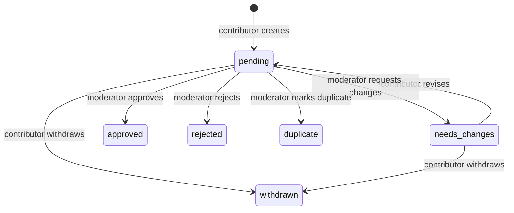

# Phase 2 Community Album Submissions

Status: Phase 2 submissions, approved feed, catalog corrections, reconciliation workflow, and the contributor/moderator UI slices implemented; final verification and production rollout remain deployment tasks

Last reviewed: 2026-09-02

This document is the source of truth for the Phase 2 contributor and moderator APIs, stored submission data, validation rules, privacy boundary, duplicate signals, approval publication, approved feed, catalog corrections, and remaining rollout work.

For a code-oriented walkthrough of the current moderator router, approval service, frontend workspace, errors, and tests, see the [Moderator implementation guide](./MODERATOR_IMPLEMENTATION_GUIDE.md).

## Current scope

Phase 2a lets an authenticated Clerk user:

- Submit a proposed album with evidence.
- Submit a field-level correction against an existing local catalog album.
- List their submission history.
- Read one of their submissions.
- Revise a submission after a moderator requests changes.
- Withdraw an active submission.

An allowlisted moderator can read a contributor submission through the same detail endpoint, or use the dedicated moderator queue/detail and command routes.

Anyone can read the minimal approved-submission feed. That feed exposes approval events and current public catalog metadata, not private proposal history.

Submissions are private workflow records. Creating or revising one never creates an `AlbumCatalog` record and therefore cannot make pending metadata appear in public search, album routes, feeds, statistics, reviews, saves, likes, profiles, boards, or notifications.

The implementation is centered on:

- `models/AlbumSubmission.js` for the aggregate, embedded revisions, and audit events.
- `routes/suggestions.js` for the contributor API and anonymous approved feed.
- `routes/utils/submissions.js` for new-album/correction normalization, validation, fingerprints, duplicate candidates, pagination cursors, private/public serialization, and configuration parsing.
- `routes/moderation.js` for moderator authorization, queue/detail reads, and explicit state commands.
- `routes/utils/approval.js` for transactional, idempotent catalog creation, linking, and selected-field correction.
- `routes/utils/rateLimit.js` for contributor mutation limits.

### Phase 2 status

| Capability | Status |
| --- | --- |
| Submission aggregate, validation, revisions, and audit events | Implemented |
| Contributor create, history, detail, revise, and withdraw API | Implemented |
| Submission feature flag and contributor mutation limits | Implemented |
| Advisory catalog and active-submission duplicate signals | Implemented |
| Moderator queue, detail, authorization boundary, and commands | Implemented |
| Idempotent approval and immediate `AlbumCatalog` publication | Implemented |
| Public approved-submission feed | Anonymous cursor API, current-catalog serializer, reconciliation command, and standalone public page implemented |
| Moderator-approved catalog corrections | Aggregate, contributor API, moderator diff/field selection, guarded transactional patch, and catalog revision guards implemented |
| Contributor and moderator UI | New-album workflow plus correction editor, stale-diff review, field selection, and approved-feed page implemented |

## Configuration

The existing API requirements still apply:

- `MONGO_URI`
- `CLERK_SECRET_KEY`
- `CLERK_PUBLISHABLE_KEY` or `VITE_CLERK_PUBLISHABLE_KEY`

Phase 2 adds three optional variables:

| Variable | Behavior |
| --- | --- |
| `COMMUNITY_SUBMISSIONS_ENABLED` | Submission mutations are enabled only when this value is `true`, ignoring case and surrounding whitespace. It is disabled when missing or set to any other value. Read endpoints remain available. |
| `MODERATOR_USER_IDS` | Comma-separated Clerk user IDs allowed to read any submission detail and use moderator routes. This is a server-only allowlist. |
| `COMMUNITY_MODERATION_ENABLED` | Moderator commands are enabled only when this value is `true`. Moderator reads remain available while commands are disabled. |

Example local values:

```dotenv
COMMUNITY_SUBMISSIONS_ENABLED=true
MODERATOR_USER_IDS=user_abc123,user_def456
COMMUNITY_MODERATION_ENABLED=true
```

The rate limiters use process memory, matching the rest of the current API. Each API instance therefore maintains its own counters. Each moderator receives 120 commands per 10 minutes; contributor creation remains 6 per 10 minutes and contributor revision/withdrawal remains 20 per 10 minutes. Shared storage is required before horizontally scaling the API. Except for `/health`, requests also pass through the global limit of 300 requests per IP per five minutes. `TRUST_PROXY_HOPS` controls Express proxy handling and therefore affects IP-based keys. Unexpected limiter failures log and fail open rather than taking down the API.

## Public identity and privacy

Every submission receives an immutable UUID v4 exposed as `submissionId`. MongoDB `_id` values remain internal.

Public contributor responses never expose:

- The submission document `_id`.
- Internal `AlbumCatalog` ObjectIds.
- Internal candidate-submission ObjectIds.
- Raw duplicate-signal keys or another contributor's proposal.

Responses reduce internal matching data to `hasPossibleDuplicate` and, when an album reference is populated, a public `candidateAlbumId` or `approvedAlbumId`.

Private contributor and moderator endpoints require Clerk authentication. `GET /suggestions/approved` is the deliberate anonymous exception and uses a separate minimal serializer. A detail request made by an authenticated user who is neither the owner nor allowlisted returns `404`, not `403`, so the API does not reveal whether another user's private submission exists.

## Submission aggregate

`AlbumSubmission` stores the current proposal and its complete history in one document.

| Field | Purpose |
| --- | --- |
| `submissionId` | Immutable public UUID v4. |
| `submissionType` | Server-authored `new_album` or `catalog_correction`; existing records default to `new_album`. |
| `submittedByUserId` | Clerk user ID taken from server authentication, never from the request body. |
| `proposedMetadata` | Current normalized complete album proposal for `new_album`; absent for corrections. |
| `supportingSources` | One to ten HTTPS evidence links. |
| `externalReferences` | Up to twenty structured non-Spotify provider references. |
| `normalizedFingerprint` | SHA-256 review signal. New albums derive it from normalized identity metadata; corrections hash the target, baseline revision, and normalized changes. |
| `targetAlbumCatalogId` | Internal fixed correction target; only public `targetAlbumId` is serialized. |
| `baseCatalogRevision`, `baseValues`, `baseProvenance` | Correction baseline captured for the proposed field groups. Provenance is moderator-only audit context. |
| `proposedChanges` | Strict correction patch grouped into supported catalog fields. |
| `candidateAlbumCatalogId` | Optional internal reference to a possible existing catalog match. |
| `candidateSubmissionIds` | Up to ten internal references to possible active-submission matches. |
| `duplicateSignals` | Internal match type, target type, match key, and target reference; at most twenty signals are retained by the API. |
| `status` | Current workflow state. |
| `approvedAlbumCatalogId` | Catalog album created, linked, or corrected by approval; required whenever status is `approved`. |
| `approvedAt` | Immutable first-approval timestamp shared with the appended approval event. |
| `approvalPublicationType` | `catalog_created`, `catalog_linked`, or `catalog_corrected`; required for approved records. |
| `duplicateOfSubmissionId` | Approved submission selected by a moderator duplicate decision; required whenever status is `duplicate`. |
| `currentRevision` | Starts at `1` and increments after each accepted revision. |
| `revisions` | Append-only complete proposal snapshots, including the duplicate state at submission time. |
| `moderationHistory` | Append-only actor, action, reason, and timestamp events. Correction approval adds a strict applied-field summary. |
| `createdAt`, `updatedAt` | Mongoose timestamps. |

Embedded schemas use strict mode. Unknown database fields throw instead of being silently stored.

Revisions and moderation history are append-only application-service invariants. Contributor and moderator routes use `$push`, while Mongoose query middleware rejects replacement/removal updates and non-append `$push` options. Direct database writers must preserve the same rule.

### Indexes

The model defines indexes for:

- Unique `submissionId` lookup.
- Contributor history ordered by `createdAt` and `_id` descending.
- Moderator queue ordering by status and update time.
- Public approval feed ordering by status, `approvedAt`, and `_id` descending.
- Fingerprint and status lookup.
- Exact external-reference lookup.
- Barcode lookup.
- Catalog-number lookup.

Indexes follow the repository's current Mongoose auto-index behavior. A production index-build runbook remains deployment work.

## Workflow states

The schema supports:

- `pending`
- `needs_changes`
- `approved`
- `rejected`
- `duplicate`
- `withdrawn`

Contributor and moderator APIs implement the transitions below. Moderator commands are limited to pending submissions; needs-changes submissions return to pending only through contributor revision.



Contributor commands use conditional atomic updates:

- Revision requires ownership, status `needs_changes`, and the previously read `currentRevision`. A concurrent change returns `409 REVISION_CONFLICT`.
- Withdrawal requires ownership and status `pending` or `needs_changes`. A concurrent change returns `409 STATE_CONFLICT`.
- No API accepts an arbitrary status value, reviewer identity, moderation note, audit event, or revision number.
- No deletion endpoint exists. Closed submissions remain available for audit and future duplicate detection.

Moderator commands use `MODERATOR_USER_IDS`, return `401` to anonymous callers and `403 MODERATOR_REQUIRED` to authenticated non-moderators, and are disabled with `503 MODERATION_DISABLED` unless `COMMUNITY_MODERATION_ENABLED=true`. Reads remain available while that flag is off.

The model recognizes these moderation-history actions so later moderator services can use the same aggregate:

- `submitted`
- `revised`
- `withdrawn`
- `request_changes`
- `approved`
- `rejected`
- `marked_duplicate`

## Request contract

Create and revise accept the same body shape. Only these three root properties are allowed:

```json
{
  "proposedMetadata": {
    "title": "Kind of Blue",
    "artistDisplayName": "Miles Davis",
    "artistCredits": [
      {
        "name": "Miles Davis",
        "role": "main"
      }
    ],
    "releaseType": "album",
    "releaseDate": "1959-08-17",
    "releaseDatePrecision": "day",
    "releaseYear": 1959,
    "label": "Columbia",
    "country": "US",
    "catalogNumber": "CL 1355",
    "barcode": "012345678905",
    "tracks": [
      {
        "discNumber": 1,
        "trackNumber": 1,
        "title": "So What",
        "durationMs": 562000,
        "artistDisplayName": "Miles Davis"
      }
    ],
    "coverSourceUrl": "https://example.com/kind-of-blue-cover.jpg"
  },
  "supportingSources": [
    {
      "type": "musicbrainz",
      "url": "https://musicbrainz.org/release-group/example",
      "description": "Structured release-group evidence"
    }
  ],
  "externalReferences": [
    {
      "provider": "musicbrainz",
      "entityType": "release-group",
      "externalId": "example",
      "url": "https://musicbrainz.org/release-group/example"
    }
  ]
}
```

### Album metadata

| Property | Rules |
| --- | --- |
| `title` | Required, trimmed, maximum 200 characters. |
| `artistCredits` | Required array containing 1–20 objects. Each credit requires `name` up to 200 characters; `role` is optional, defaults to `main`, and is limited to 80 characters. |
| `artistDisplayName` | Optional, maximum 300 characters. When omitted, credit names are joined with ` & `. |
| `releaseType` | Required: `album`, `ep`, `single`, `mixtape`, `soundtrack`, `compilation`, `live`, `remix`, or `other`. |
| `releaseDate` | Optional only when `releaseYear` is supplied. Accepted forms are `YYYY`, `YYYY-MM`, and `YYYY-MM-DD`; invalid calendar dates are rejected. |
| `releaseDatePrecision` | Optional; if supplied it must match the date. The normalized value is always `year`, `month`, or `day`. |
| `releaseYear` | Optional when a date is supplied; otherwise required as an integer from 1–9999. It must match the date when both are present. |
| `label` | Optional, maximum 200 characters. |
| `country` | Optional, maximum 100 characters. |
| `catalogNumber` | Optional, maximum 100 characters. |
| `barcode` | Optional. Spaces and hyphens are removed, then 8–14 digits are required. |
| `tracks` | Optional array with at most 200 entries. |
| `coverSourceUrl` | Optional HTTPS direct cover-image URL, maximum 2048 characters. A moderator reviews the URL; when the suggestion is approved into a new album, this URL is published as its cover without a server-side fetch. |

Each track accepts only `discNumber`, `trackNumber`, `title`, `durationMs`, and `artistDisplayName`:

- Disc and track numbers default to `1` and the array position, respectively, and must be integers from 1–999.
- Title is required and limited to 200 characters.
- Duration defaults to `0` and must be a non-negative integer no greater than 86,400,000 milliseconds.
- Track artist display name is optional and limited to 300 characters.

### Supporting sources

One to ten source objects are required. Each accepts only:

- `type`: `musicbrainz`, `official_artist`, `official_label`, `distributor`, `store`, `spotify`, or `other`.
- `url`: required HTTPS URL, maximum 2048 characters.
- `description`: optional, maximum 200 characters.

Spotify URLs are evidence only. They are allowed as a `spotify` supporting source but cannot be stored as an external reference and never trigger a Spotify API request.

### External references

Zero to twenty references may be supplied. Each accepts only:

- `provider`: required, lowercased, maximum 50 characters.
- `entityType`: required, lowercased, maximum 50 characters.
- `externalId`: required, maximum 200 characters.
- `url`: optional HTTPS URL, maximum 2048 characters.

Duplicate `(provider, entityType, externalId)` entries in one request are rejected. Provider `spotify` is rejected here and must be represented as supporting evidence.

Unknown fields at any accepted request level return a validation error. The API never spreads `req.body` into a database write.

## Duplicate signals

Duplicate detection is advisory. A match never rejects, merges, approves, or publishes a submission.

The API checks:

- Exact `(provider, entityType, externalId)` references against `AlbumCatalog` and active submissions.
- Exact barcode and catalog-number representations where available.
- A normalized fingerprint against active submissions and bounded same-type/year catalog candidates.

Fingerprint construction:

1. Normalize title and artist names with Unicode NFKD.
2. Remove combining marks.
3. Lowercase, replace non-alphanumeric runs with spaces, and collapse whitespace.
4. Sort normalized artist names.
5. Combine normalized title, artists, release type, and release year.
6. Hash the result with SHA-256.

The normalized text fingerprint is a moderator-review signal, not a uniqueness rule. Distinct releases can legitimately share similar metadata.

## Contributor API

All routes are mounted below `/suggestions`. Private contributor routes require Clerk authentication; `GET /suggestions/approved` is anonymous.

### `POST /suggestions`

Creates a submission.

- Requires `COMMUNITY_SUBMISSIONS_ENABLED=true`.
- Limited to 6 creations per authenticated user per 10 minutes.
- Normalizes and validates the body before any database write.
- Records duplicate candidates without blocking creation.
- Creates status `pending`, revision `1`, one full revision snapshot, and a `submitted` audit event.
- Returns `201` with the detailed submission representation.

### `POST /suggestions/corrections`

Creates a `catalog_correction` submission against one exact local `albumId`.

- Requires authentication, `COMMUNITY_SUBMISSIONS_ENABLED=true`, and the contributor create rate limit.
- Requires the target catalog album to exist before normalization.
- Stores the target's internal relation, current `catalogRevision`, values/provenance for proposed groups, normalized changes, evidence, revision `1`, and a `submitted` event.
- Never writes the catalog album during submission creation.
- Returns `201` with the private detail representation and populated public target album.

### `GET /suggestions/approved`

Returns the anonymous newest-first approval feed. It requires neither Clerk authentication nor either mutation feature flag. Its minimal privacy contract, cursor behavior, and response shape are documented under [Public approved-submission feed](#public-approved-submission-feed).

### `GET /suggestions/mine`

Returns the current user's history, newest first.

Query parameters:

- `limit`: defaults to 20 and is capped at 50.
- `cursor`: opaque base64url cursor returned by the previous page.

The cursor contains ordering values for `createdAt` and internal `_id`, but the encoded value is opaque to API consumers. It cannot cross the ownership filter.

Response:

```json
{
  "suggestions": [],
  "nextCursor": null
}
```

List entries omit revision and moderation-history arrays. A malformed cursor returns `400 INVALID_CURSOR`.

The list query does not populate candidate or approved catalog references. It reliably exposes `hasPossibleDuplicate`, while public candidate or approved album UUIDs are available from the populated detail response.

### `GET /suggestions/:submissionId`

Returns detailed contributor-visible history.

- Available to the owner or a Clerk user listed in `MODERATOR_USER_IDS`.
- Returns `404` for a missing submission or an authenticated caller without access.
- Includes revision snapshots and moderation history.
- Populates catalog candidates and correction targets only through public album representations.

### `POST /suggestions/:submissionId/revise`

Appends a full revision and resubmits the proposal.

- Requires `COMMUNITY_SUBMISSIONS_ENABLED=true`.
- Shares a limit of 20 revisions or withdrawals per authenticated user per 10 minutes.
- Requires ownership and current status `needs_changes`.
- Selects the request contract from stored `submissionType`. A new album revalidates the complete proposal and recalculates duplicates; a correction re-reads its fixed target and captures a fresh baseline for the complete proposed patch.
- Increments `currentRevision`, appends a `revised` event, and returns status to `pending`.
- Uses the previously read revision number in the update filter to prevent concurrent overwrites.

### `POST /suggestions/:submissionId/withdraw`

Closes an active owned proposal.

- Requires `COMMUNITY_SUBMISSIONS_ENABLED=true`.
- Shares the 20-per-10-minute mutation limit.
- Accepts only `pending` or `needs_changes`.
- Atomically changes status to `withdrawn` and appends a `withdrawn` event.
- A terminal or concurrently changed submission returns `409`.

There is no `DELETE` endpoint or arbitrary status endpoint.

## Moderator API

Moderator routes are mounted below `/moderation/album-suggestions` and require Clerk authentication plus membership in `MODERATOR_USER_IDS`. Mongo `_id` values never appear in these responses.

### `GET /moderation/album-suggestions`

Returns the queue oldest-first by `updatedAt` and `_id`.

- `status` is an optional comma-separated subset of `pending`, `needs_changes`, `approved`, `rejected`, `duplicate`, and `withdrawn`; it defaults to `pending`.
- `submissionType` optionally filters to exactly `new_album` or `catalog_correction`.
- `hasPossibleDuplicate` and `submittedByUserId` are optional filters.
- `limit` defaults to 20 and is capped at 50.
- `cursor` is an opaque `{updatedAt, _id}` cursor; malformed filters or cursors return `400`.
- The response is `{ suggestions, nextCursor }`. Queue entries contain proposal metadata, submitter, status, revision, timestamps, evidence counts/types, and `hasPossibleDuplicate`, but not revision or audit arrays.

### `GET /moderation/album-suggestions/:submissionId`

Returns full proposal history, evidence, revisions, moderation history, and sanitized duplicate candidates. Correction detail adds its normalized current target, baseline revision/values, proposed changes, and moderator-only baseline provenance. Candidate albums use public `albumId` values. Candidate submissions use public `submissionId` values and limited core metadata; raw match keys and Mongo IDs are omitted.

### Moderator commands

All command bodies are strict and reject unknown fields, client-supplied reviewer identity, status, audit data, and revision values.

| Endpoint | Body | Transition |
| --- | --- | --- |
| `POST /:submissionId/request-changes` | `{ reason }` | `pending → needs_changes` |
| `POST /:submissionId/reject` | `{ reason }` | `pending → rejected` |
| `POST /:submissionId/mark-duplicate` | `{ duplicateOfSubmissionId, reason }` | `pending → duplicate` |
| `POST /:submissionId/approve` for `new_album` | `{ albumId?, confirmPossibleDuplicate?, reason? }` | `pending → approved`, creating or linking |
| `POST /:submissionId/approve` for `catalog_correction` | `{ applyFields, reason? }` | `pending → approved`, patching the fixed target |

Reasons are required, trimmed, and limited to 1,000 characters for change requests, rejections, and duplicate decisions. Approval reason is optional with the same limit. Duplicate targets must be another approved submission with a usable catalog album. Existing catalog matches are handled by explicit `albumId` selection rather than `mark-duplicate`. Correction approval requires a non-empty subset of proposed field groups and rejects album selection or any supplied duplicate confirmation.

A first successful state-changing command appends one moderation-history event. Request-changes, reject, and mark-duplicate reload moderator detail and return `{ suggestion, duplicateCandidates }`. Approval returns `{ suggestion, album, albumUrl, idempotent }`; an already-approved idempotent retry returns the existing result without appending another event. Concurrent or stale commands return `409 STATE_CONFLICT`.

## Approval publication

Approval runs through one transactional, idempotent service and branches from stored `submissionType`. New-album approval rechecks duplicate candidates inside the transaction, never auto-links a candidate, and requires `confirmPossibleDuplicate=true` before creating a new album when only advisory matches exist. Exact catalog-reference matches require an explicit `albumId`. Correction approval skips duplicate discovery and provider work; it applies only selected proposed fields to the fixed target under a catalog-revision guard.

When creating an album, the service copies normalized title, artist credits, release fields, tracks, label, and external references; adds normalized barcode/catalog-number references; sets `catalogSource: "community"`; generates local album/track UUIDs; and applies cover precedence of moderator-reviewed `coverSourceUrl`, then a best-effort deterministic Cover Art Archive lookup, then an empty `cover`. The lookup runs before the transaction and is accepted only when the pending submission revision is unchanged when re-read. It never fetches a submitted URL, fuzzy-matches metadata, or blocks approval when the provider is unavailable or artwork is unresolved. Supporting evidence and country remain private to the submission record.

When Cover Art Archive resolves artwork, the service stores its canonical `front-500` URL and records cover provenance (provider, resolution method, source MusicBrainz identifiers, image details, submission, revision, moderator, and approval time). Any exact MusicBrainz references derived by the lookup are added to the newly created catalog record. Explicit `albumId` approvals only link the selected album and never apply the suggestion's cover or identity references to it. Retrying an approved suggestion returns the existing catalog album without repeating artwork lookup or appending another audit event.

Each copied catalog field receives field-level provenance containing `source: "community"`, the public submission ID, revision, approving Clerk user ID, and approval timestamp. Linking an existing catalog album does not overwrite that album.

Correction approval constructs a strict patch from `applyFields`, validates the complete resulting album, rejects stale `catalogRevision` values and cross-album external-reference collisions, increments the target revision once, replaces provenance only for applied fields, and appends an immutable application summary to the approval event. It preserves the album's public/internal identity, `catalogSource`, omitted data, and social relations. The detailed rules appear under [Moderator-approved catalog corrections](#moderator-approved-catalog-corrections).

Catalog creation, linking, or correction; the submission status transition; `approvedAt` and publication type; and the approval audit event run in one Mongo transaction. Unsupported standalone Mongo returns `503 APPROVAL_UNAVAILABLE`; it never performs an unsafe create-then-update sequence. Retrying an already approved submission returns the same catalog album without creating, linking, patching, or appending again.

## Response representation

List and detail responses use these public fields when available:

```text
submissionId
submittedByUserId
submissionType
status
proposedMetadata
supportingSources
externalReferences
currentRevision
hasPossibleDuplicate
candidateAlbumId       optional public album UUID
approvedAlbumId        optional public album UUID
duplicateAlbumId       optional public album UUID for a duplicate decision
targetAlbumId          optional correction target UUID
targetAlbum            optional populated current catalog representation
baseCatalogRevision    correction only
baseValues             correction only
proposedChanges        correction only
approvedAt             approved records
publicationType        approved records
createdAt
updatedAt
```

Detail responses additionally contain:

```text
revisions[]
moderationHistory[]
```

Moderator correction detail may additionally expose `baseProvenance`; ordinary contributor serialization omits it. Internal candidate submission IDs and duplicate-signal records are intentionally omitted. The public approved feed does not reuse this representation.

## Error contract

This table covers the community API surface. The [central error and status code reference](./ERROR_CODES.md) also documents rate-limit budgets, provider diagnostics, operator workflows, and client-only codes.

| Status | Code or shape | Meaning |
| --- | --- | --- |
| `400` | `INVALID_SUBMISSION` | Request shape, field value, date, count, URL, or Mongoose validation failed. Normalizer errors also include `details`. |
| `400` | `INVALID_CURSOR` | Pagination cursor could not be decoded or validated. |
| `401` | `{ "error": "Unauthorized", "code": "UNAUTHORIZED" }` on moderator routes; contributor routes preserve the existing shape | Clerk did not provide a user ID. |
| `403` | `MODERATOR_REQUIRED` | Authenticated caller is not in the moderator allowlist. |
| `404` | `SUGGESTION_NOT_FOUND` | Submission is absent or private to another user. |
| `409` | `INVALID_SUBMISSION_STATE` | Revision, withdrawal, or moderation command is not allowed from the current state. |
| `409` | `REVISION_CONFLICT` or `STATE_CONFLICT` | A concurrent mutation invalidated the conditional update. |
| `409` | `EXACT_CATALOG_MATCH`, `POSSIBLE_DUPLICATE_CONFIRMATION_REQUIRED`, or `INVALID_DUPLICATE_TARGET` | Moderator must resolve an exact match, confirm an advisory duplicate, or select a valid approved duplicate target. |
| `409` | `CATALOG_CHANGED`, `CATALOG_BASELINE_INVALID`, or `CATALOG_TARGET_MISSING` | A correction target or baseline is stale, invalid, or missing; no patch is applied. |
| `409` | `CATALOG_REFERENCE_CONFLICT` | A selected external-reference addition belongs to another catalog album. |
| `429` | `RATE_LIMITED` | Per-user mutation bucket was exhausted. Includes `retryAfterSeconds` and a `Retry-After` header. |
| `503` | `SUBMISSIONS_DISABLED` | Contributor mutations are disabled by feature flag. |
| `503` | `MODERATION_DISABLED` or `APPROVAL_UNAVAILABLE` | Moderator commands are disabled or Mongo transactions are unavailable. |
| `500` | Endpoint-specific `error` message | Unexpected server or database failure. |

## Tests and verification

Run the backend tests:

```sh
npm test
```

Run the replica-set-backed approval tests in an environment that permits local Mongo processes:

```sh
npm run test:integration
```

The normal `npm test` run keeps these integration cases skipped unless `RUN_MONGO_INTEGRATION=true` is supplied.

Run the provider-neutral catalog guard:

```sh
npm run check:catalog-contract
```

`tests/submissions.test.js` and `tests/moderation.test.js` cover:

- Metadata, date, barcode, URL, source, and fingerprint normalization.
- Unknown-field, insecure-URL, and Spotify-reference rejection.
- Schema UUID, index, approval-reference, and duplicate-reference invariants.
- Opaque cursor round trips and invalid cursors.
- Initial revision and audit creation.
- Advisory duplicate candidates.
- Contributor pagination.
- Disabled mutations and anonymous authentication failures.
- Rate limiting before database writes.
- Owner privacy and moderator allowlist reads.
- Revision, withdrawal, and terminal-state behavior.
- Public serialization without internal identifiers.
- Moderator authentication, allowlist privacy, queue filters/cursors, command transitions, reasons, duplicate targets, feature flags, approval mapping, idempotent retries, and transaction-unavailable handling.

The optional integration suite uses a MongoMemoryReplSet for real transaction, index, rollback, and concurrency behavior.

### Known implementation constraints

- Append-only revisions and audit history are enforced by route/service behavior plus Mongoose query middleware; direct database access should still be restricted.
- The API normalizer caps external references at twenty, and duplicate discovery caps retained signals at twenty; direct database writers must preserve those bounds because the top-level arrays do not repeat both limits at the schema layer.
- Pagination cursors are opaque base64url JSON but are not signed. Tampering can only move the caller's pagination position because every query independently enforces `submittedByUserId`.
- Submission and moderator route tests use mocked persistence for fast contract coverage. `npm run test:integration` runs the replica-set-backed transaction, rollback, provenance, and concurrency checks; the normal `npm test` run skips them unless `RUN_MONGO_INTEGRATION=true` is supplied.
- Public-exclusion behavior follows structurally from never writing a pending submission into `AlbumCatalog`; the integration suite verifies that pending metadata has no catalog row before approval.
- Existing catalog rows and historical approvals are reconciled with the dry-run-first `db:reconcile-community-state` command before enabling the public feed or correction submissions. Runtime defaults are not a substitute for this data check.
- The approved feed and correction workflows have standalone React presentation, while attribution remains intentionally anonymous and correction conflicts remain server-authoritative.
- The shared approval normalizer accepts the union of fields needed by both approval modes, then the server-owned `submissionType` branch rejects `applyFields` for new-album approvals and rejects album/duplicate controls for corrections.

## Phase 2 exit gate

The core Phase 2 backend is complete when the moderator route tests and transaction-backed create/link approval tests pass, and pending, needs-changes, rejected, duplicate, and withdrawn submissions remain absent from public catalog and social queries. Feed/correction rollout additionally requires the focused and integration coverage below, a reviewed reconciliation report, deployed indexes, and the feature flags enabled in the intended environment. Production index rollout remains a deployment task.

## Approved-feed and catalog-correction extensions

The sections below define the backend contract now represented in the aggregate, routes, serializers, approval service, reconciliation command, and React surfaces. The create/link distinction remains authoritative: selecting `albumId` on a new-album approval only links. Catalog changes require a separate `catalog_correction` submission and explicit applied fields.

### Decision summary

- `GET /suggestions/approved` is a chronological public record of approved submissions, not a replacement for the review, profile-activity, or catalog feeds.
- A feed item resolves the album's current display metadata from `AlbumCatalog`; it does not publish the submitted snapshot as a second catalog representation.
- The public response omits contributor identity, supporting evidence, revisions, moderation history, moderator identity, duplicate signals, and provenance. Contributor attribution requires a separate opt-in and private-profile policy before it can be added.
- The feed contains one item per approved submission, including link-only approvals and catalog corrections. It does not deduplicate by album because it is an event history rather than a catalog index.
- "Album upsert" means a moderator-approved, field-level correction to one explicitly targeted `AlbumCatalog` record. It does not mean a generic MongoDB upsert, fuzzy matching, or create-if-missing behavior.
- A correction never changes the target album's `albumId`, Mongo `_id`, `catalogSource`, or social relations. Omitted catalog fields and their provenance remain unchanged.
- Catalog correction, submission transition, applied-field audit data, feed metadata, and provenance changes commit in one Mongo transaction or not at all.
- The artifact-driven catalog importer remains a separate operator workflow. Its merge implementation may supply shared normalization ideas, but correction approval must not call the importer or inherit dataset-only ownership assumptions.

## Public approved-submission feed

### Goal and boundary

The feed makes successful community moderation visible without making workflow records public. It answers "what submissions were approved recently?" The public catalog remains the source of truth for what each album looks like now.

The backend route is:

```http
GET /suggestions/approved?limit={limit}&cursor={cursor}
```

The route is anonymous and read-only. It is registered before `GET /suggestions/:submissionId`, remains available when contributor or moderation mutations are disabled, and makes no provider calls or database writes.

The first version does not add filtering, search, ranking, reactions, comments, or a general activity collection. A standalone frontend page or homepage placement is a separate presentation slice; the API contract does not depend on that choice.

### Approval event fields and indexing

Stable feed ordering uses explicit server-authored fields on `AlbumSubmission`:

| Field | Purpose |
| --- | --- |
| `approvedAt` | Immutable timestamp written with the first successful approval. It must use the same timestamp as the append-only `approved` moderation event. |
| `approvalPublicationType` | Server-authored enum: `catalog_created`, `catalog_linked`, or `catalog_corrected`. It describes what approval did without exposing moderation internals. |

Both fields are required only when status is `approved` and cannot be client-authored. New approvals set them inside the approval transaction, and idempotent retries preserve their original values. The feed sorts by `{ approvedAt: -1, _id: -1 }`, uses an opaque base64url cursor containing those ordering values, and is backed by `{ status: 1, approvedAt: -1, _id: -1 }`.

Before enabling the feed over an existing database, run a reviewed reconciliation that derives `approvedAt` from the single appended `approved` moderation event and classifies historical approvals as created or linked from durable catalog provenance. Ambiguous or inconsistent records are reported for review rather than guessed. This is a bounded schema reconciliation, not permission to rewrite submission history.

Do not use submission `updatedAt` or catalog `createdAt` as an approval-time substitute. Future catalog corrections and maintenance can change those timestamps without representing a new approval.

### Query and response contract

The query includes only records with:

- `status: "approved"`.
- A non-null `approvedAlbumCatalogId` that still resolves to an `AlbumCatalog` record.
- A valid `approvedAt` and `approvalPublicationType`.

`limit` defaults to 20 and is capped at 50. A malformed cursor returns `400 INVALID_CURSOR`. Results are newest-first and use `_id` only as the internal ordering tie-breaker; the decoded Mongo ID is never returned separately.

Example response:

```json
{
  "suggestions": [
    {
      "submissionId": "00000000-0000-4000-8000-000000000000",
      "approvedAt": "2026-09-01T12:00:00.000Z",
      "publicationType": "catalog_created",
      "album": {
        "albumId": "11111111-1111-4111-8111-111111111111",
        "title": "Example album",
        "artistDisplayName": "Example artist",
        "artistCredits": [],
        "releaseType": "album",
        "releaseDate": "2026",
        "releaseDatePrecision": "year",
        "releaseYear": 2026,
        "cover": "",
        "tracks": [],
        "label": "",
        "externalReferences": [],
        "catalogSource": "community"
      }
    }
  ],
  "nextCursor": null
}
```

The `album` value uses the same normalized public representation as album detail. If an album is corrected after an earlier approval, older feed items intentionally show its current display metadata. The event timestamp and publication type remain historical facts.

A dangling or malformed approved catalog reference is an integrity error. For each request, the route reads at most `limit + 1` ordered submission rows, inspects at most the first `limit`, omits invalid populated items, and bases `nextCursor` on the last inspected row rather than the last emitted item. A page may therefore contain fewer than `limit` items, including zero, while a non-null cursor still advances past corrupt rows. The extra row determines whether another page exists. Each omission records structured server-side diagnostics without request credentials or private submission data. Reconciliation and integration tests must treat such records as failures even though one corrupt row does not take down the public feed.

### Public privacy contract

The feed serializer is purpose-built and must not reuse the contributor or moderator detail serializer. It returns only `submissionId`, `approvedAt`, `publicationType`, and the normalized current album. It never exposes:

- `submittedByUserId` or Clerk profile data.
- Supporting sources, country, or the submitted cover-source URL as evidence.
- Proposed metadata as a second album snapshot.
- Revision snapshots or moderation history.
- Moderator user IDs, reasons, or applied-field decisions.
- Duplicate candidates, raw match keys, or workflow status.
- MongoDB IDs or field-level provenance.

Publishing contributor attribution later requires an explicit contributor choice, a defined private-profile fallback, and tests proving that disabling attribution removes both the profile link and raw Clerk user ID. It is not inferred merely because an album was approved.

### Feed implementation slices

1. **Event persistence and reconciliation — implemented:** approval fields, validation, index, transactional writes, and the dry-run/report-first `scripts/reconcileCommunityPublication.js` workflow cover created, linked, and corrected approvals.
2. **Public read API — implemented:** cursor parsing, minimal serialization, populated catalog reads, corrupt-row progress, and route-level handling exist. The static `/approved` route precedes `/:submissionId`, with focused contract coverage.
3. **Presentation — implemented:** `/community/approved` provides loading, empty, error, and pagination states and keeps feed objects as links to current catalog albums rather than saveable submission records.

### Feed acceptance criteria

- Anonymous callers can page through approved events without Clerk authentication.
- Pending, needs-changes, rejected, duplicate, and withdrawn submissions never appear.
- Created, linked, and corrected approvals have exactly one immutable event timestamp and publication type.
- Results use stable newest-first cursor pagination under timestamp ties and concurrent new approvals.
- The response contains valid public `submissionId` and `albumId` values and no MongoDB IDs.
- Current `AlbumCatalog` metadata is returned after a later catalog correction; no denormalized public snapshot is introduced.
- Repeated approvals for one album remain separate feed events in deterministic order.
- Supporting evidence, contributors, moderators, revisions, duplicate data, and provenance do not leak.
- A corrupt catalog reference does not expose private data, prevent cursor progress, or fail every otherwise valid item, and it produces an actionable integrity diagnostic. A page containing only corrupt rows is covered explicitly.
- Normal tests make no live provider calls.

## Moderator-approved catalog corrections

### Terminology and current boundary

The approval path supports three distinct outcomes:

| Outcome | Current behavior |
| --- | --- |
| Create | No `albumId` is supplied, so approval creates a new community catalog album. |
| Link | A moderator supplies an existing `albumId`, so approval links the suggestion and deliberately leaves the album unchanged. |
| Correct | A `catalog_correction` targets one existing album and a moderator applies an explicit non-empty subset of proposed fields. The backend and moderator field-selection UI are implemented. |

The correction outcome is intentionally separate from link behavior. Supplying `albumId` to the existing new-album approval command must never start copying the full proposal over the selected album.

### Correction submission shape

The aggregate uses a server-authored `submissionType` enum:

- `new_album` for every existing submission; use this as the backward-compatible default.
- `catalog_correction` for the new workflow.

A correction stores an internal `targetAlbumCatalogId` and exposes only `targetAlbumId`. Every revision stores:

- `baseCatalogRevision`, captured when that revision is submitted.
- `baseValues`, containing the catalog values for only the proposed field groups.
- `baseProvenance`, containing the corresponding prior provenance entries for audit.
- A strict `proposedChanges` object.
- Supporting sources and any duplicate/reference-conflict signals relevant to the patch.

This baseline preserves the review-time current-versus-proposed diff even if the catalog later changes. It is not a public or authoritative catalog snapshot.

`baseProvenance` is internal audit data. Contributor responses omit it because prior provenance may contain moderator or operator identifiers; moderator detail may expose only the sanitized provenance needed to review ownership. The public feed never includes it.

The static contributor endpoint is registered before `/:submissionId`:

```http
POST /suggestions/corrections
```

Example request:

```json
{
  "albumId": "11111111-1111-4111-8111-111111111111",
  "proposedChanges": {
    "title": "Corrected title",
    "releaseDate": {
      "releaseDate": "2026-09-01",
      "releaseDatePrecision": "day",
      "releaseYear": 2026
    },
    "externalReferences": {
      "add": [
        {
          "provider": "musicbrainz",
          "entityType": "release-group",
          "externalId": "22222222-2222-4222-8222-222222222222",
          "url": "https://musicbrainz.org/release-group/22222222-2222-4222-8222-222222222222"
        }
      ]
    }
  },
  "supportingSources": [
    {
      "type": "musicbrainz",
      "url": "https://musicbrainz.org/release-group/22222222-2222-4222-8222-222222222222",
      "description": "Correct release-group identity"
    }
  ]
}
```

The endpoint requires Clerk authentication, `COMMUNITY_SUBMISSIONS_ENABLED=true`, the contributor create rate limit, a valid local `albumId`, at least one effective change after normalization, and one to ten supporting sources. Unknown or client-owned workflow fields are rejected before any write.

Correction revisions use the existing `POST /suggestions/:submissionId/revise` route with the correction request shape selected by the stored `submissionType`. Contributor history and detail remain owner-private and add `submissionType`, `targetAlbum`, baseline, and proposed changes. The moderator queue adds an optional `submissionType` filter and returns the target album summary; moderator detail returns the complete baseline/current/proposed diff.

### Mutable field groups

Changes are patches: omission always means "leave unchanged." The first version may target only these public catalog field groups:

| Group | Canonical request value | Application rule |
| --- | --- | --- |
| `title` | A string. | Replace with one validated nonblank title. |
| `artists` | `{ artistDisplayName, artistCredits }`. | Validate and apply both catalog fields together so they cannot drift independently. |
| `releaseType` | One supported release-type string. | Replace the catalog release type. |
| `releaseDate` | `{ releaseDate, releaseDatePrecision, releaseYear }`. | Validate and apply all three catalog fields as one coherent tuple. |
| `label` | A string, including an intentional empty string. | Replace explicitly; an empty string may clear an incorrect optional label. |
| `cover` | One nonblank HTTPS URL string. | Replace only with a moderator-reviewed URL. A blank never clears existing artwork, and correction approval performs no provider lookup or image fetch. |
| `tracks` | The complete ordered array of `{ trackId?, discNumber, trackNumber, title, durationMs, artistDisplayName }`. | Replace the track list. An existing entry may reference a `trackId` that already belongs to the target album; the server verifies and preserves it even when metadata is corrected. New entries omit `trackId` and receive UUID v4 values. Unknown, cross-album, duplicate, or otherwise arbitrary track IDs are rejected. |
| `externalReferences` | `{ add: [{ provider, entityType, externalId, url? }] }`. | Apply only explicit additions after normalization and uniqueness checks. Omission never removes a reference. Reference removal, identity reassignment, album merging, and edition splitting remain separate work. |

The client cannot propose a replacement `albumId`, Mongo `_id`, `catalogSource`, `fieldProvenance`, timestamps, approval fields, or arbitrary track IDs. Referencing a target album's existing public `trackId` only identifies the track whose identity must be preserved; it does not let the client assign an ID. Country, catalog number, and barcode remain submission evidence unless separately normalized into an allowed explicit external-reference addition.

Correction external references inherit the existing provider-neutral rule: `spotify` is rejected as an external-reference provider, and Spotify URLs may appear only as supporting evidence. Revisions contain the complete desired value for each replacement group. `externalReferences.add` is the deliberate exception because it is an explicit operation list rather than a replacement value. The service never interprets an omitted field group or omitted reference as a deletion outside the explicit full-track-list replacement rule.

Cover correction is intentionally offline. The submitted HTTPS URL is reviewed but not fetched, proxied, downloaded, or treated as licensed by Rescened. Its catalog provenance records the submitted source URL and correction audit fields. Automatic Cover Art Archive resolution remains limited to the existing new-album approval path unless a later provider-integration scope defines bounded calls, failure isolation, and fixture tests for corrections.

### Catalog revision token

`AlbumCatalog` has an internal positive integer `catalogRevision`. New rows start at `1`; a reviewed one-time reconciliation must initialize existing rows before correction submissions are enabled. The token is not part of the public normalized album representation.

Every supported generation-2 catalog writer must condition on the revision it read and increment it exactly once for a successful mutation. This includes community corrections, imported-record refreshes, cover backfills, and any maintained manual-edit path. Create-only publication initializes the token but does not need a prior revision. Direct database writers remain restricted and must follow the same rule.

The correction revision stores `baseCatalogRevision`, and approval guards on that exact value. This monotonic token, rather than timestamp equality, makes stale detection deterministic even when two writes occur within one clock tick. Catalog `updatedAt` remains useful display and diagnostics metadata but is not the correctness boundary.

### Moderator review and approval contract

The existing workflow states and request-changes, reject, withdraw, and revise transitions apply to corrections. The moderator detail response must render, for every proposed group:

- The stored baseline value reviewed by the contributor.
- The target album's current value.
- The proposed value and supporting evidence.
- A stale marker when current differs from baseline.

The existing approve endpoint branches on the stored `submissionType`. A correction approval accepts only:

```json
{
  "applyFields": ["title", "releaseDate", "externalReferences"],
  "reason": "Verified against the cited release-group record"
}
```

`applyFields` must be a non-empty subset of proposed field groups. Unselected proposed groups remain unchanged and are recorded as not applied; selecting a field the contributor did not propose is rejected. `albumId`, duplicate confirmation, and a replacement target are invalid in a correction approval body. A moderator who accepts no field must request changes or reject instead of approving an empty patch.

The appended `approved` moderation event adds one optional strict `application` object for corrections:

```json
{
  "targetAlbumId": "11111111-1111-4111-8111-111111111111",
  "proposedFields": ["title", "releaseDate", "externalReferences"],
  "appliedFields": ["title", "releaseDate"],
  "unappliedFields": ["externalReferences"],
  "baseCatalogRevision": 7,
  "resultCatalogRevision": 8
}
```

The three field arrays are deduplicated, placed in one fixed server-side field order, and limited to the defined field-group enum. They form a complete partition of the proposed groups. This application data is visible only in the existing owner/moderator detail boundary and is explicitly excluded from the public feed serializer. It is appended with the approval event in the same transaction; an idempotent retry does not append, replace, or reorder it.

The successful response keeps the current `{ suggestion, album, albumUrl }` shape and returns `publicationType: "catalog_corrected"` through the suggestion representation. A retry returns the same result with `idempotent: true` and never reapplies fields or appends another event.

### Transaction, concurrency, and provenance

Correction approval performs these steps inside one Mongo transaction:

1. Re-read the pending correction and its target album.
2. Verify the submission revision and stored target identity.
3. Require the album's `catalogRevision` to equal that revision's `baseCatalogRevision`. Any supported intervening catalog write returns `409 CATALOG_CHANGED`; the service never silently rebases or field-merges against a new version.
4. Construct a strict server-owned patch containing only `applyFields`, validate the complete resulting `AlbumCatalog` document, and recheck external-reference uniqueness.
5. Conditionally update the target by internal `_id`, immutable public `albumId`, and expected `catalogRevision`, then increment the revision exactly once.
6. For every applied field, replace its catalog provenance with `source: "community"`, the public correction `submissionId`, revision, approving user ID, and approval time. Cover provenance also retains the submitted source URL without making a license claim. The prior provenance remains in the correction revision's immutable `baseProvenance`; it is not recursively nested into the current catalog entry.
7. Preserve the target's `albumId`, `_id`, `catalogSource`, omitted fields, omitted provenance, and all existing social references.
8. Set the submission to approved, retain `approvedAlbumCatalogId`, set `approvedAt` and `approvalPublicationType: "catalog_corrected"`, and append the one approval event with its immutable application object.

If any conditional update, validation, uniqueness check, submission transition, or audit write fails, the transaction rolls back. Standalone Mongo returns `503 APPROVAL_UNAVAILABLE`; there is no non-transactional fallback. A duplicate external reference returns `409 CATALOG_REFERENCE_CONFLICT` with public candidate `albumId` values where safe. A missing target returns `409 CATALOG_TARGET_MISSING` and never creates a replacement album.

`catalogSource` describes how the album entered the catalog and therefore does not change after a correction. Community provenance on corrected fields ensures a later automated import preserves those fields under the existing ownership rules.

### Correction non-goals

The first correction slice does not include:

- Generic database upsert endpoints or moderator-authored direct writes.
- Fuzzy title/artist matching or provider IDs used as Rescened album identity.
- Automatic application of provider data or external search candidates.
- External-reference removals or reassignment.
- Album deletion, merging, edition splitting, or moving reviews, likes, boards, and profile references.
- Bulk corrections, unattended imports, or correction approval on standalone Mongo.
- Optimistic UI publication before the server transaction completes.

### Correction implementation slices

1. **Aggregate and contributor API — implemented:** `submissionType`, target/baseline/change schemas, strict normalization, serialization, correction creation, and type-aware revision exist.
2. **Moderator review — implemented:** type filtering, populated target/baseline/proposed detail, `applyFields` normalization, applied-field audit storage, stale-diff presentation, and stable errors exist.
3. **Catalog revision rollout — implemented:** the model token and guards are present in correction approval, import refresh, cover backfill, and the reviewed reconciliation command.
4. **Transactional catalog patch — implemented:** full-document validation, guarded update, provenance replacement, idempotency, rollback structure, and create/link preservation are in the service, with focused and replica-set verification coverage.
5. **Contributor and moderator UI — implemented:** local album entry, patch editor, stale-diff presentation, moderator field selection, and server-authoritative success/conflict states are present.
6. **Feed integration — implemented:** corrected approvals use `catalog_corrected` and the existing feed serializer resolves the current catalog album without another activity collection or snapshot.

### Implementation surface

| File or area | Expected responsibility |
| --- | --- |
| `models/AlbumSubmission.js` | Submission type, target, baseline/change revisions, approval event fields, applied-field audit data, and feed index. |
| `models/AlbumCatalog.js` | Internal monotonic `catalogRevision` token and model validation. |
| `routes/suggestions.js` | Static approved-feed and correction-create routes, type-aware revision, and public/private serializers. |
| `routes/utils/submissions.js` | Strict correction normalization, snapshots, cursor helpers, and sanitized representations. |
| `routes/moderation.js` | Type filtering, correction diffs, and correction approval command parsing. |
| `routes/utils/approval.js` or a focused correction service | Transactional field patch, provenance, stale guards, conflicts, and idempotency. |
| `routes/utils/albumCatalog.js` | Reusable strict final-document validation and public normalization without adding a generic write endpoint. |
| `lib/catalogImport/persistence.js` and maintained catalog writers | Guard and increment `catalogRevision` for every successful catalog mutation. |
| `frontend/src/Components/AlbumDetail.jsx` | Contributor entry point for an existing local album. |
| `frontend/src/Pages/SuggestionEditor.jsx` | Type-aware correction editor and revision state. |
| `frontend/src/Pages/ModerationSuggestions.jsx` | Type filter and moderator diff/application workflow. |
| `tests/submissions.test.js` | Correction request, privacy, revision, and serialization contracts. |
| `tests/moderation.test.js` | Applied-field validation, provenance, stable errors, and create/link regression coverage. |
| `tests/moderation.integration.test.js` | Real transaction, concurrency, idempotency, and rollback behavior. |

### Correction acceptance criteria

- A contributor can target only an existing album by public Rescened `albumId`; external candidates and Mongo IDs are rejected.
- A correction contains at least one normalized effective change and cannot write workflow, album identity, source, timestamp, provenance, or arbitrary track-ID fields.
- Pending correction data remains private under the same owner/moderator boundary as new-album submissions.
- Moderator detail shows stable baseline, current, and proposed values for each field group.
- Approval can apply only an explicit non-empty subset of proposed groups.
- The album keeps its public UUID, Mongo relation identity, `catalogSource`, omitted fields, and omitted provenance.
- Applied fields receive community correction provenance; a later catalog import cannot overwrite them.
- Blank incoming cover data never clears existing artwork, and omitted field groups never delete catalog fields or references.
- External-reference collisions return a stable conflict and roll back all writes.
- A supported catalog change after the contributor's baseline increments `catalogRevision`; correction approval then returns `409 CATALOG_CHANGED` and leaves both album and submission unchanged.
- Concurrent approval attempts result in one patch and one appended approval event; retries are idempotent.
- Catalog patch, submission transition, applied-field audit, and feed event metadata either commit together or roll back together.
- Search, album detail, reviews, likes, profiles, activity, and boards immediately resolve the corrected metadata from the same `AlbumCatalog` record.
- Existing create and explicit-link approvals continue to pass their current contract tests unchanged.
- Normal tests use fixtures only; transaction and concurrency cases run in the replica-set integration suite.

### Decisions to confirm before presentation rollout

The presentation choices are now recorded because they affect UI and privacy, not persistence safety:

1. The first feed surface is a standalone public page at `/community/approved`, linked from the main navigation. A homepage section can reuse the same feed contract later.
2. Contributors are not attributed in the initial feed. Adding attribution requires an explicit contributor choice, a private-profile fallback, and tests proving that disabling attribution removes both the profile link and raw Clerk user ID.

## Reconciliation, verification, and rollout workflow

The deferred fields are intentionally reconciled as an operator-reviewed migration rather than inferred at request time. This keeps the feed's ordering timestamp tied to the append-only `approved` event and gives catalog corrections a deterministic optimistic-concurrency baseline.

1. Run a read-only plan against the selected database and retain the report:

   ```sh
   npm run db:reconcile-community-state -- --dry-run --report .migration/community-state/reconciliation-report.json
   ```

2. Review `catalogUpdates`, `submissionUpdates`, and `ambiguous`. The command initializes only missing `catalogRevision` values and derives missing approval metadata from exactly one valid `approved` event plus durable catalog provenance. It reports conflicting timestamps, unsupported publication types, missing albums, malformed revision values, and missing/duplicate approval events instead of guessing.

3. After the report is explicitly approved for the named database, apply that exact dry-run artifact. The command requires both the report and an exact database-name confirmation, and runs all writes in one Mongo transaction:

   ```sh
   npm run db:reconcile-community-state -- --apply \
     --confirm-target rescened \
     --report .migration/community-state/reconciliation-report.json
   ```

   A concurrent change causes the transaction to fail; it does not silently rebase or partially initialize records. Keep the reviewed report with the deployment record. Database commit status is distinct from report or process finalization status.

4. Verify the focused contract and integration suites before enabling flags:

   ```sh
   npm test
   npm run test:integration
   npm run check:catalog-contract
   npm --prefix frontend run lint
   npm --prefix frontend run build
   ```

   The integration suite requires a transaction-capable MongoDB replica set. A skipped or unavailable integration run is not evidence that correction approval is safe on standalone MongoDB.

### Design rationale

The implementation follows four boundaries. First, approval events are immutable workflow facts while `AlbumCatalog` remains the current public projection; this is why the feed stores only approval metadata and resolves current album values at read time. Second, corrections are explicit field-group patches rather than a full proposal copy, so a moderator can approve a title without overwriting an unrelated cover, tracklist, or social relation. Third, `catalogRevision` is a monotonic token instead of a timestamp comparison, making stale detection deterministic under close writes. Fourth, each catalog mutation, provenance update, submission transition, and audit application is transactional, so public publication cannot get ahead of the workflow record.

The UI mirrors those boundaries: contributors edit only supported public fields and provide evidence; moderators see baseline/current/proposed values and select applied groups; anonymous visitors see approved events and current album links only. Provider fetching remains outside correction approval, and unresolved or corrupt historical data is surfaced for operator review instead of being made public by a fallback.

### Explicitly later

- MusicBrainz-assisted suggestion prefill. Broad catalog import remains the separate artifact-driven workflow documented in `CATALOG_IMPORT.md`.
- Album merges, editions, and contributor reputation.
